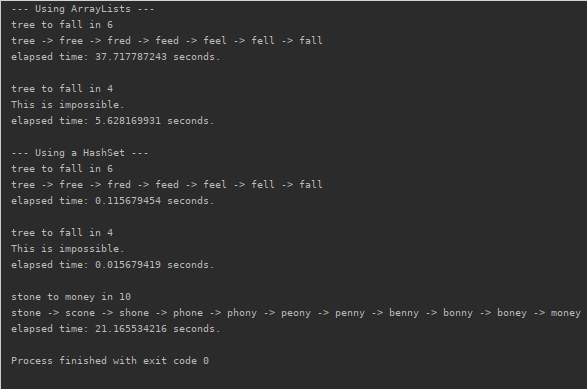

# EditDistance
Java program to determine if a String can be converted into another one in a number of steps. This
program currently only uses the replace operation, with a corpus dictionary of over 100,000 allowed words.

It compares the running times of utilizing an ArrayList and a HashSet.

Results have found that utilizing a HashSet is significantly faster.

Note: left out `stone to money in 10` for ArrayList as it takes hours

